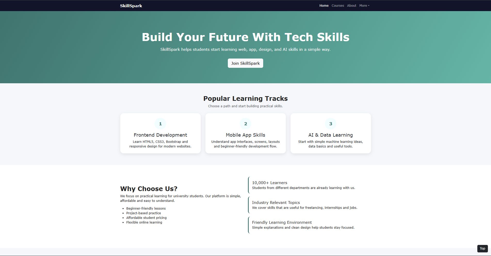
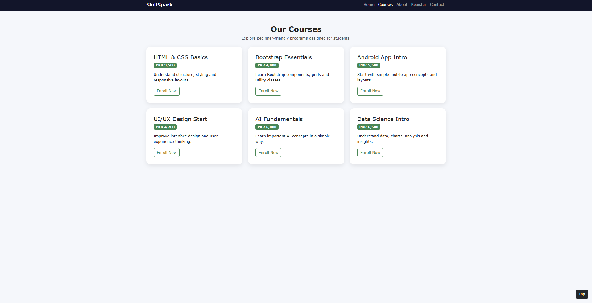
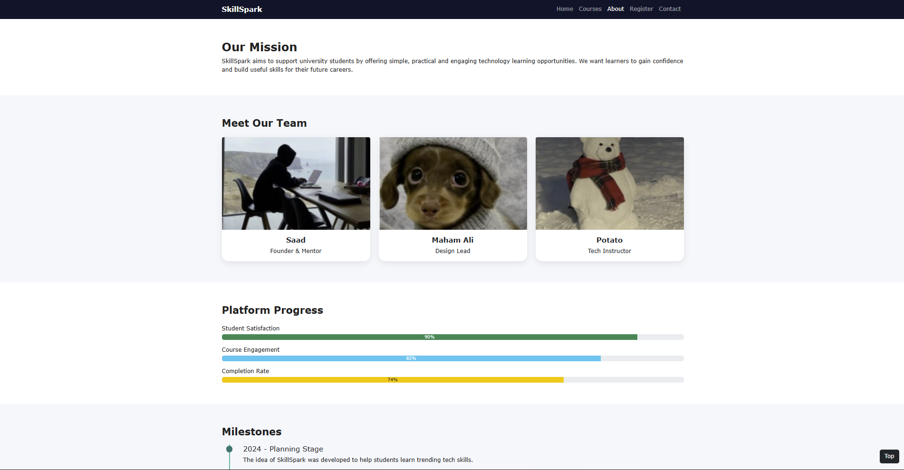
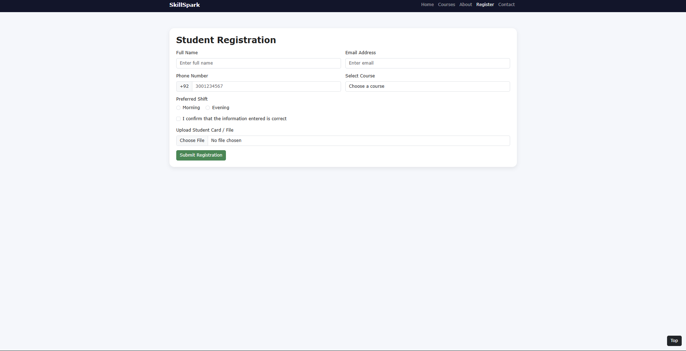
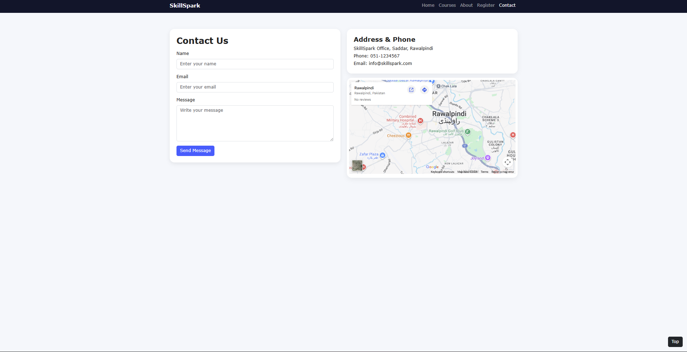

# SkillSpark – Learn. Build. Launch
## Project Description
SkillSpark is a responsive promotional website created for a startup learning platform. It is designed for university students who want to improve their skills in Web Development, App Development, UI/UX Design, and AI & Data Science.
The project is built using HTML5, CSS3, Bootstrap 5, and GitHub. It focuses on clean design, responsiveness and basic user interface components without using any backend.

## Features

### Home Page
- Responsive navbar with dropdown
- Hero section with call-to-action button
- Three feature cards
- Why Choose Us section
- Testimonials carousel
- Footer with social links

### Courses Page
- Six course cards
- Price badges
- Enroll Now buttons
- Modal popup for details
- Hover card effect

### About Page
- Mission section
- Team members with images
- Progress bars
- Timeline / milestone section

### Registration Page
- Two-column responsive form
- Dropdown, radio buttons and checkbox
- File upload option
- Validation styling
- Success alert

### Contact Page
- Contact form
- Google map iframe
- Address and phone details
- Success alert

## Technologies Used
- HTML5
- CSS3
- Bootstrap 5
- Git & GitHub

## Screenshots
Add screenshots here after taking images of each page.

### Home Page

### Courses Page

### About Page

### Registration Page

### Contact Page
